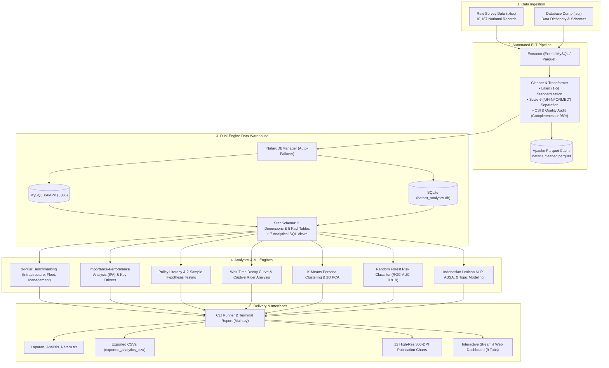

# 🚆 NATARU Multimodal Transportation Analytics & Decision Support System

> **An End-to-End Public Transportation Analytics System, Automated ELT Pipeline, Star Schema Data Warehousing, Machine Learning & Interactive Executive Dashboard for Holiday Travel Operations.**

[](https://www.python.org/)
[](https://streamlit.io/)
[](https://www.mysql.com/)
[](https://scikit-learn.org/)
[](https://plotly.com/)
[](https://parquet.apache.org/)
[-brightgreen.svg)]()
[]()

---

## 📌 Executive Summary

This repository hosts a production-grade analytics platform evaluating passenger experience, service quality, and policy interventions during Indonesia's peak holiday travel season (**Nataru - Christmas & New Year 2025/2026**). 

Built with a modular Python architecture, the system analyzes **10,187 validated national survey responses** across **6 transport modes**:
- 🚆 **Railways (Kereta Api)**
- 🚢 **Ferry / Maritime Crossings (ASDP Penyeberangan)**
- ✈️ **Commercial Aviation (Angkutan Udara)**
- 🛳️ **Sea Transport / Pelni (Angkutan Laut)**
- 🚗 **Private Vehicles (Highway Toll & Arterial Roads)**
- 🚌 **Public Bus Transit (AKAP / AKDP Buses)**

### 📊 Key Empirical Findings

| Metric | Empirical Result | Strategic Interpretation |
|---|---|---|
| **Customer Satisfaction Index (CSI)** | **87.42%** | Overall rating: **Very Good / Satisfied** |
| **Average Likert Satisfaction** | **4.37 / 5.00** | Consolidated 1–5 performance score |
| **Satisfied Passenger Ratio** | **90.74%** | Rated $\ge 4.0$ on overall service quality |
| **Top Performing Mode** | **Railways (4.72 / 5.00)** | Leads in Infrastructure (4.70), Fleet (4.70), & Operations (4.75) |
| **Improvement Priority Mode** | **Public Bus (4.18 / 5.00)** | Requires terminal upgrades, fleet renewal, and schedule reliability |
| **IPA Priority (Quadrant I)** | **Safety, Security, & Punctuality** | Highest influence on satisfaction; critical focus for intervention |
| **Wait-Time Tipping Point** | **1 – 3 Hours** | Sharpest decline in satisfaction occurs when transit wait times exceed 1 hour |
| **Captive Rider Penalty** | **-3.60 CSI Points** | Involuntary users report significantly lower satisfaction due to ticket sell-outs |
| **Early Warning ML Model** | **ROC-AUC: 0.919** | Random Forest model detects **19.41%** passengers at high risk of dissatisfaction |

---

## 🏗️ System Architecture



---

## ⚡ Key Capabilities

- **Automated ELT & Parquet Caching**: Extracts from Excel or database dumps, handles missing values, validates Likert scales (1–5), isolates scale 6 (*"Uninformed"*), and caches pre-processed datasets as compressed column-oriented Parquet files for sub-second query execution.
- **Dual-Engine Persistence**: Automatically connects to local MySQL (XAMPP `localhost:3306`) with zero-downtime automatic fallback to local SQLite (`nataru_analytics.db`).
- **Star Schema Data Modeling**: Features 2 dimension tables (`dim_responden`, `dim_perjalanan`), 5 fact tables (`fakta_evaluasi_moda`, `fakta_kebijakan_nataru`, `fakta_literasi_kebijakan`, `fakta_kepuasan_keseluruhan`, `fakta_masukan_saran`), and 7 analytical views.
- **3-Pillar Benchmarking**: Evaluates infrastructure, fleet vehicles, and operational management across all modes.
- **Importance-Performance Analysis (IPA)**: Ranks service attributes into 4 strategic action quadrants using Pearson correlation and multivariate regression weights ($\beta$).
- **Policy Literacy (Scale 6 Isolation)**: Isolates scale 6 (*"Don't Know"*) to compute awareness rates for 18 transport policies, executing two-sample independent t-tests ($p < 0.05$) to measure policy stimulus effects on passenger satisfaction.
- **Wait-Time Decay Diagnosis**: Models satisfaction degradation across wait-time intervals, identifying inflection points where ratings plummet.
- **Captive vs. Choice Rider Analytics**: Quantifies the penalty of involuntary transport choice caused by sold-out tickets.
- **Unsupervised Persona Clustering**: Groups travelers into 3 personas (*High-Efficiency Commuters*, *Service-Critical Travelers*, *Budget & Family Travelers*) via K-Means, verified by Elbow and Silhouette methods with 2D PCA spatial visualization.
- **Supervised Early Warning Risk Engine**: Random Forest classifier predicting passenger dissatisfaction risk (**ROC-AUC 0.919**) with an interactive scenario simulator.
- **Indonesian NLP & Aspect-Based Sentiment (ABSA)**: Parses thousands of open feedback comments using lexicon sentiment scoring, 3-pillar aspect classification, N-gram mining (bi-grams/tri-grams), and topic extraction.
- **GIS Origin-Destination (OD) & Sankey Flows**: Visualizes nationwide travel corridors, transit hub performance, and multimodal passenger movement.

---

## 📂 Repository Structure

```text
PROJECT-ANALISIS-DATA-NATARU/
├── Main.py                                           # Central Entrypoint (CLI Runner & Dashboard Launcher)
├── requirements.txt                                  # Python Dependencies
├── .env.example                                      # Environment Variable Template
├── nataru_analytics.db                               # Local SQLite Database (Pre-built Fallback)
├── Database_Nataru.sql                               # MySQL Schema & Dictionary Dump
├── Data Asli dan cleaning SurveyNataru20252026_Kirim.xlsx  # Raw & Pre-cleaned Dataset
├── data_cache/
│   └── nataru_cleaned.parquet                        # Compressed Columnar Cache
├── grafik_analisis_nataru/                           # 12 High-Resolution Charts (300 DPI PNG & HTML)
├── nataru/                                           # Core Modular Package
│   ├── config/                                       # Settings, DB Config, & GIS Coordinates
│   ├── database/                                     # Dual-Engine Manager (MySQL / SQLite)
│   ├── pipeline/                                     # ELT Pipeline, Cleaner, & Star Schema Builder
│   ├── analytics/                                    # KPI, IPA, K-Means, RF Classifier, NLP, & GIS
│   ├── visualization/                                # 12 Chart Exporter & Interactive Map Builder
│   └── dashboard/                                    # 9-Tab Streamlit Dashboard & Custom UI Styles
└── tests/
    └── run_tests.py                                  # Automated Unit & Integration Test Suite
```

---

## 🚀 Quickstart & Installation

### 1. Prerequisites
- **Python 3.10+** installed.
- *(Optional)* **XAMPP / MySQL** running on port 3306. If unavailable, the system defaults automatically to SQLite.

### 2. Setup Environment
```bash
# Clone the repository
git clone https://github.com/BruhBruh149/PROJECT-ANALISIS-DATA-NATARU.git
cd PROJECT-ANALISIS-DATA-NATARU

# Create and activate virtual environment
python -m venv venv
# On Windows:
.\venv\Scripts\activate
# On Linux/macOS:
source venv/bin/activate

# Install required packages
pip install -r requirements.txt
```

### 3. Environment Configuration *(Optional)*
Copy `.env.example` to `.env` to override MySQL settings if desired:
```bash
cp .env.example .env
```

---

## 💻 CLI Commands & Usage

The application is controlled via `Main.py`:

```bash
# 1. Launch the Interactive Web Dashboard
python Main.py --dashboard

# 2. Launch Dashboard forcing local SQLite database
python Main.py --dashboard --sqlite

# 3. Run Automated Self-Tests (23 Checks)
python Main.py --test

# 4. Execute Headless ELT Pipeline (Extract, Clean, Model, & Cache)
python Main.py --pipeline

# 5. Generate & Print Full Executive Analytics Report
python Main.py --analytics

# 6. Export 12 High-Resolution Publication Charts (300 DPI PNG)
python Main.py --visualize

# 7. Run K-Means Passenger Persona Segmentation in Terminal
python Main.py --clustering

# 8. Export All Modeled Tables and Views to CSV
python Main.py --export-csv

# 9. Check Database Engine & Record Count
python Main.py --status
```

---

## 🖥️ Executive Dashboard (9 Interactive Tabs)

Access the Streamlit dashboard at `http://localhost:8501` by running `python Main.py --dashboard`:

| Tab | Focus Area | Key Visualizations & Tools |
|---|---|---|
| **1. Summary & 3 Pillars** | Strategic Overview | KPI metrics cards, CSI bar charts, modal market share pie chart, 3-pillar benchmarking, and service dimension radar charts. |
| **2. Hub Ranking & GIS Map** | Infrastructure Hubs | Best and worst performing airports, train stations, ferry ports, and bus terminals; interactive OpenStreetMap GIS layer. |
| **3. Policy Literacy** | Policy Effectiveness | Awareness vs. "Uninformed" (Scale 6) rates across 18 programs, pure effectiveness scores, and two-sample t-test significance results. |
| **4. Wait Times & OD Flows** | Operational Flow | Wait-time decay curves identifying tipping points, top OD route matrices, and multimodal Sankey flow diagrams. |
| **5. Captive Riders** | Involuntary Travel | Disparity metrics comparing choice riders vs. captive riders, investigating root causes such as ticket availability. |
| **6. Key Drivers & Simulator** | Action Priorities & ML | 4-Quadrant IPA scatter plot, Pearson & regression driver rankings, and real-time interactive policy risk simulator. |
| **7. Persona Segmentation** | Passenger Personas | Unsupervised K-Means clustering, 2D PCA spatial scatter plot, Elbow & Silhouette evaluation charts, and persona profiles. |
| **8. NLP & Sentiment** | Qualitative Feedback | Indonesian lexicon sentiment polarity, Aspect-Based Sentiment Analysis (ABSA), keyword frequencies, bi-gram/tri-gram phrases, and complaint topic modeling. |
| **9. Publication Gallery** | Print-Ready Artifacts | Direct preview gallery of all 12 publication-ready 300-DPI charts. |

---

## 📈 12 High-Resolution Publication Charts

Generated automatically into `grafik_analisis_nataru/` via `python Main.py --visualize`:

1. `01_csi_kepuasan_multi_moda.png` — Multimodal Customer Satisfaction Index (CSI %).
2. `02_benchmarking_3_pilar_moda.png` — 3-Pillar Benchmarking (Infrastructure, Fleet, Management).
3. `03_efektivitas_dan_literasi_kebijakan.png` — Policy Awareness Rate vs. Scale 6 (Uninformed).
4. `04_wait_time_decay_curve.png` — Wait-Time Degradation Curve and Inflection Points.
5. `05_matriks_rantai_antarmoda.png` — First-Mile Accessibility and Volume Matrix.
6. `06_captive_vs_choice_riders.png` — Disparity Analysis: Choice vs. Captive Passengers.
7. `07_importance_performance_analysis_ipa.png` — 4-Quadrant Priority Matrix (IPA).
8. `08_peringkat_simpul_transportasi.png` — Major Transit Hub Satisfaction Rankings.
9. `09_key_driver_analysis.png` — Key Driver Rankings (Pearson correlation $r$).
10. `10_analisis_nlp_isu_keluhan.png` — NLP Keyword Extraction of Operational Complaints.
11. `11_segmentasi_persona_kmeans.png` — K-Means Persona Profiles (CSI vs. Wait Time).
12. `12_analisis_sentimen_distribusi.png` — Feedback Sentiment Polarity Distribution (Donut & Bar).

---

## 🧪 Automated Testing

The project includes an internal test suite (`tests/run_tests.py`) covering all architecture tiers:

```text
================================================================================
      STARTING NATARU ANALYTICS SYSTEM INTEGRITY & UNIT TEST SUITE
================================================================================

1. Multi-Engine Database Connectivity:
  [V] [01] Detected Database Engine: SQLITE / MYSQL                         : PASS
  [V] [02] SQL Ping Query Execution                                         : PASS

2. Star Schema & Data Integrity:
  [V] [03] Table `dim_responden` Populated (10,187 records)                 : PASS
  [V] [04] Table `dim_perjalanan` Populated (10,187 records)                : PASS
  [V] [05] Table `fakta_evaluasi_moda` Populated (10,187 records)           : PASS
  [V] [06] Table `fakta_kebijakan_nataru` Populated (10,187 records)        : PASS
  [V] [07] Table `fakta_literasi_kebijakan` Populated (18 policies)         : PASS
  [V] [08] Table `fakta_kepuasan_keseluruhan` Populated (10,187 records)    : PASS

3. K-Means Persona Clustering & 2D PCA:
  [V] [09] Cluster Dataframe Successfully Populated                         : PASS
  [V] [10] Persona Label Assigned                                           : PASS
  [V] [11] Exactly 3 Persona Segments Identified                            : PASS
  [V] [12] 2D PCA Projections (pca_x, pca_y) Computed                       : PASS
  [V] [13] Elbow & Silhouette Scores Evaluated                              : PASS

4. Key Drivers & Priority Matrix (IPA):
  [V] [14] IPA Evaluation Matrix Computed                                   : PASS
  [V] [15] Grand Means for Performance and Importance Valid                 : PASS

5. NLP N-grams, Aspect Sentiment (ABSA), & Sankey OD:
  [V] [16] Topic Modeling Extracted 6 Complaint Clusters                    : PASS
  [V] [17] Bi-gram Mining Identified Top Phrases                            : PASS
  [V] [18] ABSA Evaluated Sentiment Across 3 Pillars                        : PASS
  [V] [19] Sankey OD Matrix Formed Valid Connection Flows                   : PASS

6. Supervised Machine Learning (Random Forest):
  [V] [20] Model Assessed Dissatisfaction Risk Rates (19.41% High Risk)     : PASS
  [V] [21] Model Achieved ROC-AUC of 0.919 (> 0.80 benchmark)               : PASS
  [V] [22] Single-Scenario Simulator Output Valid                           : PASS

7. High-Resolution Visualizer Engine:
  [V] [23] 12 High-Resolution (300 DPI) Publication Charts Generated        : PASS

================================================================================
  FINAL RESULT: 23 OUT OF 23 TESTS PASSED (100% SUCCESS RATE)
================================================================================
```

---

## 🛠️ Technology Stack

| Component | Technology | Version | Purpose |
|---|---|---|---|
| **Core Language** | Python | `>= 3.10` | Primary logic, data processing, and ML pipelines |
| **Data Processing** | Pandas, NumPy | `>= 2.0.0`, `>= 1.24.0` | Tabular data manipulation, aggregation, and linear algebra |
| **Columnar Storage** | PyArrow | `>= 12.0.0` | Apache Parquet serialization and low-latency cache reading |
| **Spreadsheet Engine** | OpenPyXL | `>= 3.1.0` | Ingestion of raw Excel survey files |
| **Database Drivers** | PyMySQL, SQLite3 | `>= 1.0.0`, Built-in | Relational database access with multi-engine fallback |
| **Machine Learning** | Scikit-Learn | `>= 1.3.0` | K-Means clustering, PCA, Random Forest classification, ROC-AUC |
| **Interactive UI** | Streamlit | `>= 1.30.0` | Real-time interactive decision support web dashboard |
| **Interactive Charts** | Plotly | `>= 5.18.0` | Web charts, Sankey flow diagrams, and HTML exports |
| **Publication Plots** | Matplotlib | `>= 3.7.0` | High-resolution 300-DPI raster image generation |
| **Config & Env** | Python-Dotenv | `>= 1.0.0` | Environment configuration management |

---

## 📄 License & Contribution

This project is licensed under the **MIT License**. Contributions, bug reports, and enhancements are welcome via Pull Requests or Issues on the GitHub repository:
👉 **[BruhBruh149/PROJECT-ANALISIS-DATA-NATARU](https://github.com/BruhBruh149/PROJECT-ANALISIS-DATA-NATARU)**

---
*Developed as a Decision Support System for public transportation management, policy evaluation, and passenger experience analytics in Indonesia.*
