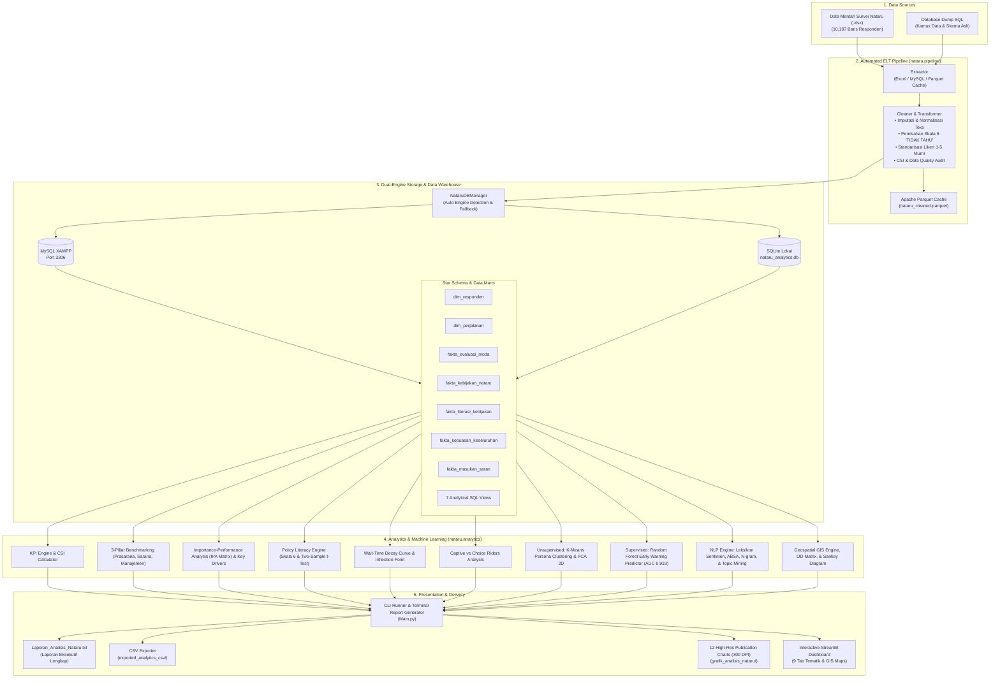

# 🚆 SISTEM ANALITIK & EVALUASI PENYELENGGARAAN TRANSPORTASI NATARU

> **End-to-End Multimodal Public Transportation Analytics System, Automated ELT Pipeline, Star Schema Data Warehousing, Machine Learning & Interactive Executive Dashboard**

[](https://www.python.org/)
[](https://streamlit.io/)
[](https://www.mysql.com/)
[](https://scikit-learn.org/)
[](https://plotly.com/)
[](https://parquet.apache.org/)
[-brightgreen.svg)]()
[]()

---

## 📑 Daftar Isi
1. [Ringkasan Proyek](#-ringkasan-proyek)
2. [Sorotan Temuan Utama](#-sorotan-temuan-utama)
3. [Fitur-Fitur Utama](#-fitur-fitur-utama)
4. [Arsitektur Sistem & Alur Pipeline](#-arsitektur-sistem--alur-pipeline)
5. [Model Basis Data (Star Schema & Analytical Views)](#-model-basis-data-star-schema--analytical-views)
6. [Struktur Direktori Repositori](#-struktur-direktori-repositori)
7. [Panduan Instalasi & Pengaturan](#-panduan-instalasi--pengaturan)
8. [Panduan Penggunaan (CLI & Runner)](#-panduan-penggunaan-cli--runner)
9. [Eksplorasi Fitur Dashboard (9 Tab Interaktif)](#-eksplorasi-fitur-dashboard-9-tab-interaktif)
10. [Visualisasi Publikasi Resolusi Tinggi (12 Charts)](#-visualisasi-publikasi-resolusi-tinggi-12-charts)
11. [Hasil Pengujian Otomatis (Self-Tests)](#-hasil-pengujian-otomatis-self-tests)
12. [Teknologi & Dependensi](#-teknologi--dependensi)
13. [Kontribusi & Lisensi](#-kontribusi--lisensi)

---

## 📖 Ringkasan Proyek

Proyek ini merupakan sistem analitik data transportasi publik dan evaluasi kebijakan berskala nasional untuk masa libur **Natal dan Tahun Baru (Nataru) 2025/2026**. Dibangun secara end-to-end dengan arsitektur modular Python, sistem ini memproses data survei empiris yang mencakup **10.187 responden valid** di seluruh wilayah Indonesia pada 6 moda transportasi utama:

1. 🚆 **Kereta Api (KA)**
2. 🚢 **ASDP (Angkutan Sungai, Danau, dan Penyeberangan)**
3. ✈️ **Angkutan Udara (Pesawat)**
4. 🛳️ **Angkutan Laut (Kapal Pelni / Swasta)**
5. 🚗 **Kendaraan Pribadi (Jalan Tol & Non-Tol)**
6. 🚌 **Angkutan Umum Jalan (Bus AKAP/AKDP)**

Sistem ini dirancang tidak hanya untuk menyajikan visualisasi data deskriptif, melainkan juga menerapkan metodologi riset transportasi tingkat lanjut seperti **Benchmarking 3 Pilar Mutu Layanan**, **Importance-Performance Analysis (IPA Matrix)**, evaluasi **Literasi Kebijakan Publik (Pemisahan Skala 6 "TIDAK TAHU")**, pemodelan **Wait-Time Decay Curve**, **Segmentasi Penumpang Unsupervised (K-Means Clustering + PCA 2D)**, **Topic Modeling & Leksikon Sentimen NLP Bahasa Indonesia**, serta deteksi dini risiko ketidakpuasan berbasis **Supervised Machine Learning (Random Forest Classifier)**.

---

## 💡 Sorotan Temuan Utama

Berdasarkan komputasi analitik terhadap **10.187 responden nasional**:

| Indikator Kunci | Nilai Empiris | Keterangan / Interpretasi |
|---|---|---|
| **Customer Satisfaction Index (CSI)** | **87.42%** | Kategori **Sangat Baik / Puas** secara agregat nasional |
| **Rata-Rata Skor Kepuasan** | **4.37 / 5.00** | Skala Likert Terkonsolidasi (1 - 5) |
| **Persentase Publik Puas** | **90.74%** | Responden memberikan skor kepuasan $\ge 4$ |
| **Moda Performa Tertinggi** | **Kereta Api (4.72)** | Unggul konsisten pada pilar prasarana (4.70), sarana (4.70), & manajemen operasional (4.75) |
| **Moda Prioritas Perbaikan** | **Angkutan Umum Bus (4.18)** | Membutuhkan revitalisasi fasilitas terminal, kenyamanan armada, dan integrasi tiket |
| **Prioritas Utama IPA (Kuadran I)** | **Keamanan Simpul, Standar Keselamatan Fisik Armada, Ketepatan Waktu (Punctuality)** | Faktor berbobot pengaruh terbesar terhadap kepuasan namun kinerja masih berada di bawah target |
| **Titik Belok Waktu Tunggu** | **Rentang 1 - 3 Jam** | Kepuasan dan skor ketepatan waktu mengalami penurunan tertajam pada antrean transit simpul |
| **Disparitas Captive Riders** | **-3.60 Poin CSI** | Pengguna terpaksa (*captive*) memiliki kepuasan lebih rendah secara signifikan dibanding pengguna sukarela (*choice riders*) akibat kehabisan tiket |
| **Akurasi Model Early Warning** | **ROC-AUC: 0.919** | Model Random Forest mendeteksi **19.41%** responden masuk profil risiko tinggi tidak puas |

---

## ⚡ Fitur-Fitur Utama

### 1. 🔄 Pipeline ELT Otomatis & Caching Apache Parquet
- **Extract**: Membaca dataset dari Excel (`openpyxl`), MySQL dump, SQLite, maupun cache Parquet secara instan.
- **Transform**: Pembersihan data cerdas, imputasi nilai hilang berbasis pilar, pemetaan first-mile/last-mile, standarisasi simpul perhubungan (terminal/stasiun/bandara/pelabuhan), penegakan batas skala Likert 1–5 untuk kinerja layanan, dan kalkulasi individual Customer Satisfaction Index (CSI).
- **Penanganan Skala 6 (TIDAK TAHU)**: Memisahkan nilai 6 pada instrumen evaluasi kebijakan publik agar tidak merusak mean kinerja Likert (1–5), sekaligus digunakan secara independen untuk mengukur tingkat literasi/kesadaran publik (*awareness rate*) dan uji beda signifikansi stimulus kebijakan.
- **Load & Cache**: Memuat data ke tabel Star Schema serta menyimpan cache kolumnar terkompresi `nataru_cleaned.parquet` untuk latensi baca sub-detik.

### 2. 🗄️ Multi-Engine Database Manager (Dual-Engine Fallback)
- **MySQL XAMPP Support**: Terkoneksi ke `localhost:3306` database `database_nataru` melalui PyMySQL dengan opsi fallback otomatis ke MySQL CLI (`mysql.exe`).
- **SQLite Zero-Config Fallback**: Jika server MySQL lokal tidak aktif, sistem secara otomatis beralih (*failover*) ke SQLite lokal `nataru_analytics.db` tanpa menghentikan aplikasi.

### 3. 🌟 Star Schema Data Warehouse & Analytical SQL Views
- Menyusun tabel dimensi relasional (`dim_responden`, `dim_perjalanan`) dan tabel fakta teragregasi (`fakta_evaluasi_moda`, `fakta_kebijakan_nataru`, `fakta_literasi_kebijakan`, `fakta_kepuasan_keseluruhan`, `fakta_masukan_saran`).
- Membentuk 7 SQL Views analitis teroptimasi untuk kueri agregat cepat.

### 4. 🎯 Key Driver Analysis & Importance-Performance Analysis (IPA Matrix)
- Menghitung korelasi Pearson dan koefisien regresi multivariat ($\beta$) untuk menentukan atribut pelayanan yang paling menggerakkan kepuasan pelanggan.
- Memetakan indikator layanan ke dalam **4 Kuadran IPA**:
  - **Kuadran I (Prioritas Utama / *Concentrate Here*)**: Kinerja di bawah rata-rata, Kepentingan tinggi.
  - **Kuadran II (Pertahankan Prestasi / *Keep Up the Good Work*)**: Kinerja tinggi, Kepentingan tinggi.
  - **Kuadran III (Prioritas Rendah / *Low Priority*)**: Kinerja rendah, Kepentingan rendah.
  - **Kuadran IV (Berlebihan / *Possible Overkill*)**: Kinerja tinggi, Kepentingan rendah.

### 5. 📜 Evaluasi Literasi Kebijakan & Uji Beda Stimulus Kebijakan
- Mengukur persentase responden yang mengetahui (*aware*) vs tidak tahu (*unaware*) terhadap 18 program kebijakan Nataru (diskon tiket kereta api, tarif batas atas pesawat, rekayasa lalu lintas one way/contra flow, tiket online ASDP Ferizy, program mudik gratis, dan posko terpadu).
- Melakukan uji signifikansi independen dua sampel (*two-sample t-test*) untuk mengevaluasi apakah responden yang mengetahui kebijakan memiliki kepuasan yang lebih tinggi secara signifikan ($p < 0.05$).

### 6. ⏱️ Diagnosis Ambang Batas Waktu Tunggu (Wait-Time Decay Curve)
- Menganalisis kurva degradasi kepuasan penumpang seiring bertambahnya waktu tunggu di simpul transit.
- Menentukan titik belok (*inflection point*) kritis sebelum persepsi ketepatan waktu dan kepuasan anjlok.

### 7. 👥 Dinamika Pengguna Terpaksa (Captive Riders) vs Pengguna Sukarela (Choice Riders)
- Mengidentifikasi penumpang yang terpaksa menggunakan moda non-prioritas akibat kendala ketersediaan tiket atau jadwal.
- Menganalisis alasan perpindahan moda dan disparitas kepuasan antar segmen.

### 8. 🤖 Unsupervised Learning: Segmentasi Persona Penumpang (K-Means & PCA 2D)
- Mengelompokkan penumpang secara otomatis menggunakan **K-Means Clustering** berdasarkan durasi tunggu, skor evaluasi pilar, CSI, dan sensitivitas tarif.
- Dilengkapi analisis optimalitas jumlah klaster (**Elbow Method & Silhouette Score**) serta reduksi dimensi **PCA 2D** untuk visualisasi klaster spasial.
- Menghasilkan 3 persona utama:
  1. *High-Efficiency Commuters* (54.3%): Kepuasan tinggi, mobilitas efisien.
  2. *Service-Critical Travelers* (44.6%): Sangat memperhatikan aspek keamanan dan ketepatan waktu.
  3. *Budget & Family Travelers* (1.2%): Perjalanan rombongan, waktu tunggu lebih panjang, sensitif terhadap tarif.

### 9. ⚠️ Supervised Machine Learning: Early Warning Risk Predictor
- Model klasifikasi **Random Forest** terlatih untuk mendeteksi dini risiko ketidakpuasan responden dengan performa tinggi (**ROC-AUC: 0.919**).
- Dilengkapi **Kalkulator Skenario Interaktif (Simulator Kebijakan)**: Pengguna dapat menguji parameter operasional (waktu tunggu, status captive rider, skor fasilitas) dan memperoleh estimasi probabilitas risiko ketidakpuasan secara real-time.

### 10. 💬 Natural Language Processing (NLP) & Analisis Sentimen Bahasa Indonesia
- **Analisis Sentimen Berbasis Leksikon Bahasa Indonesia**: Mengklasifikasikan ribuan ulasan terbuka ke dalam sentimen Positif, Netral, dan Negatif.
- **Aspect-Based Sentiment Analysis (ABSA)**: Membedah sentimen ulasan secara terpisah pada 3 Pilar (Prasarana, Sarana, dan Manajemen Operasional).
- **N-gram Phrase Mining**: Ekstraksi frasa 2-gram dan 3-gram paling dominan untuk menangkap konteks keluhan spesifik (misal: *"jalan macet"*, *"tiket habis"*, *"antre panjang"*).
- **Topic Modeling Keluhan**: Mengelompokkan isu operasional ke dalam klaster isu utama secara terstruktur.

### 11. 🗺️ Geospasial & Alir Perjalanan (OD Flow & Sankey Diagram)
- Pemetaan alur perjalanan *Origin-Destination (OD)* pemudik antar provinsi dan kota.
- Visualisasi interaktif simpul transportasi (bandara, stasiun, pelabuhan, terminal) menggunakan OpenStreetMap / GIS.
- **Diagram Alir Sankey**: Visualisasi dinamika pergerakan antarmoda dan arus perpindahan penumpang dari simpul asal ke simpul tujuan.

### 12. 📊 Galeri Grafik Siap Cetak (12 High-Resolution Charts 300 DPI)
- Menghasilkan 12 grafik publikasi format PNG beresolusi 300 DPI dan HTML interaktif yang tersimpan rapi di direktori `grafik_analisis_nataru/`.

### 13. 🖥️ Dashboard Eksekutif Berbasis Streamlit
- Antarmuka web interaktif modern dengan 9 tab tematik, sidebar filter global dinamis (berdasarkan moda dan gender), indikator status basis data real-time, serta tombol aksi cepat (ekspor CSV, generate visualisasi, dan penyegaran pipeline).

### 14. 🧪 Pengujian Unit Otomatis Terpadu (Self-Test Suite)
- Modul pengujian terintegrasi (`tests/run_tests.py`) yang memverifikasi 23 poin pemeriksaan di seluruh subsistem dengan status **23/23 PASS (100%)**.

---

## 🏗️ Arsitektur Sistem & Alur Pipeline



---

## 🗄️ Model Basis Data (Star Schema & Analytical Views)

Basis data dimodelkan menggunakan konsep **Star Schema** untuk memfasilitasi kueri OLAP dan analitik berkecepatan tinggi:

### 1. Tabel Dimensi
- `dim_responden`: Menyimpan profil demografi (usia, jenis kelamin, pendidikan, pekerjaan, penghasilan per bulan, pengeluaran transportasi).
- `dim_perjalanan`: Menyimpan rincian perjalanan (moda, simpul asal, simpul tujuan, tanggal/waktu keberangkatan dan kedatangan, durasi waktu tunggu, moda first-mile & last-mile, status moda pilihan utama, dan status captive rider).

### 2. Tabel Fakta
- `fakta_evaluasi_moda`: Evaluasi 8 atribut layanan (fasilitas, keamanan, aksesibilitas, petugas, ketepatan waktu, kenyamanan armada, keselamatan armada, awak sarana) serta agregasi 3 pilar (Prasarana, Sarana, Manajemen Operasional).
- `fakta_kebijakan_nataru`: Evaluasi efektivitas program kebijakan transportasi (tiket online, keterjangkauan tarif, ketepatan jadwal, sosialisasi keselamatan, informasi real-time, rekayasa lalu lintas, posko terpadu).
- `fakta_literasi_kebijakan`: Agregasi tingkat literasi publik (Skala 6 "TIDAK TAHU" vs Skala 1–5 tahu), skor efektivitas murni, delta kepuasan, nilai t-statistik, dan derajat signifikansi dampak kebijakan.
- `fakta_kepuasan_keseluruhan`: Skor kepuasan konsolidasi per individu, indeks CSI (%), dan klasifikasi kategori kepuasan (Sangat Puas, Puas, Cukup Puas, Kurang Puas, Tidak Puas).
- `fakta_masukan_saran`: Teks terbuka kritik, keluhan, dan saran penumpang serta pelabelan kategori isu otomatis.

### 3. SQL Views Analitis
- `v_ringkasan_kepuasan_moda`: Agregasi CSI, rata-rata skor kepuasan, dan persentase kepuasan per moda.
- `v_benchmarking_3_pilar`: Perbandingan skor komposit pilar Prasarana, Sarana, dan Manajemen Operasional antarmoda.
- `v_efektivitas_kebijakan_nataru`: Rata-rata skor evaluasi kebijakan per sektor transportasi.
- `v_gap_evaluasi_layanan`: Rincian skor 8 dimensi mutu layanan per moda.
- `v_analisis_waktu_tunggu`: Hubungan durasi waktu tunggu terhadap kepuasan dan skor ketepatan waktu.
- `v_analisis_captive_riders`: Perbandingan metrik kepuasan antara *Captive Riders* dan *Choice Riders*.
- `v_antarmoda_first_last_mile`: Volume dan skor aksesibilitas pada rantai integrasi antarmoda *first-mile* ke *last-mile*.

---

## 📁 Struktur Direktori Repositori

```text
PROJECT-ANALISIS-DATA-NATARU/
│
├── Main.py                                           # Entrypoint Utama (CLI Runner & Dashboard Launcher)
├── requirements.txt                                  # Daftar Dependensi Pustaka Python
├── .env.example                                      # Contoh Konfigurasi Environment Variable
├── nataru_analytics.db                               # Basis Data Lokal SQLite (Fallback Siap Pakai)
├── Database_Nataru.sql                               # Skrip Dump Basis Data MySQL
├── Data Asli dan cleaning SurveyNataru20252026_Kirim.xlsx  # Dataset Survei Mentah & Bersih
│
├── data_cache/                                       # Direktori Cache Kolumnar
│   └── nataru_cleaned.parquet                        # Cache Data Hasil Transformasi (Fast Reading)
│
├── grafik_analisis_nataru/                           # Direktori Output 12 Visualisasi Resolusi Tinggi (300 DPI)
│   ├── 01_csi_kepuasan_multi_moda.png                # Chart 1: CSI Antarmoda
│   ├── 02_benchmarking_3_pilar_moda.png              # Chart 2: Benchmarking 3 Pilar
│   ├── 03_efektivitas_dan_literasi_kebijakan.png     # Chart 3: Literasi Kebijakan (Skala 6)
│   ├── 04_wait_time_decay_curve.png                  # Chart 4: Kurva Degradasi Waktu Tunggu
│   ├── 05_matriks_rantai_antarmoda.png               # Chart 5: Rantai First-Mile / Last-Mile
│   ├── 06_captive_vs_choice_riders.png               # Chart 6: Disparitas Captive vs Choice Riders
│   ├── 07_importance_performance_analysis_ipa.png    # Chart 7: Matriks Prioritas IPA (4 Kuadran)
│   ├── 08_peringkat_simpul_transportasi.png          # Chart 8: Peringkat Bandara/Simpul Utama
│   ├── 09_key_driver_analysis.png                    # Chart 9: Peringkat Key Drivers (Korelasi Pearson)
│   ├── 10_analisis_nlp_isu_keluhan.png               # Chart 10: Frekuensi Kata Kunci NLP
│   ├── 11_segmentasi_persona_kmeans.png              # Chart 11: Segmentasi Persona K-Means
│   └── 12_analisis_sentimen_distribusi.png           # Chart 12: Distribusi Sentimen Ulasan
│
├── nataru/                                           # Paket Modul Python Terpadu
│   ├── __init__.py                                   # Metadata & Ekspor Paket Nataru
│   │
│   ├── config/                                       # Modul Konfigurasi Global
│   │   ├── __init__.py
│   │   ├── settings.py                               # Pengaturan Lingkungan, Path, & Deteksi MySQL CLI
│   │   └── geo_constants.py                          # Koordinat Geospasial Provinsi & Simpul Utama
│   │
│   ├── database/                                     # Modul Pengelola Basis Data
│   │   ├── __init__.py
│   │   └── db_manager.py                             # Multi-Engine DB Manager (MySQL XAMPP & SQLite)
│   │
│   ├── pipeline/                                     # Modul Pipeline ELT
│   │   ├── __init__.py
│   │   ├── elt_pipeline.py                           # Extract, Clean & Transform, Star Schema, Parquet Cache
│   │   └── text_cleaner.py                           # Pembersih & Standarisasi Nama Simpul Perhubungan
│   │
│   ├── analytics/                                    # Modul Analitik Kuantitatif & Machine Learning
│   │   ├── __init__.py                               # Kelas Terpadu NataruAnalytics
│   │   ├── kpi_engine.py                             # Komputasi KPI, Laporan Eksekutif, & Ekspor CSV
│   │   ├── ipa_matrix.py                             # Importance-Performance Analysis & Key Drivers
│   │   ├── clustering.py                             # K-Means Persona Clustering, Elbow & Silhouette, PCA 2D
│   │   ├── ml_predictor.py                           # Model Prediksi Risiko Random Forest & Skenario Simulasi
│   │   ├── sentiment_nlp.py                          # Analisis Sentimen Indonesia, ABSA, N-gram, & Topik
│   │   └── geo_analytics.py                          # Alir OD (Origin-Destination), Simpul GIS, & Sankey Data
│   │
│   ├── visualization/                                # Modul Generator Grafik & Peta
│   │   ├── __init__.py
│   │   ├── chart_exporter.py                         # Pengekspor 12 Visualisasi Grafis (PNG 300 DPI & HTML)
│   │   └── map_builder.py                            # Peta Interaktif OpenStreetMap & Diagram Sankey Plotly
│   │
│   └── dashboard/                                    # Antarmuka Dashboard Eksekutif Streamlit
│       ├── __init__.py
│       ├── app.py                                    # Render Utama Dashboard 9 Tab Interaktif
│       └── styles.py                                 # Custom CSS Styling & Tema Modern UI
│
└── tests/                                            # Modul Pengujian Unit Otomatis
    ├── __init__.py
    └── run_tests.py                                  # Script Verifikasi Integritas Sistem (23 Tests)
```

---

## 🚀 Panduan Instalasi & Pengaturan

### 1. Prasyarat Sistem
- **Python 3.10** atau versi yang lebih baru terpasang di sistem.
- *(Opsional)* **XAMPP (MySQL)** jika ingin menggunakan engine basis data MySQL lokal pada port 3306. Jika tidak ada XAMPP, sistem akan secara otomatis menggunakan basis data **SQLite** bawaan (`nataru_analytics.db`).

### 2. Klon Repositori
```bash
git clone https://github.com/BruhBruh149/PROJECT-ANALISIS-DATA-NATARU.git
cd PROJECT-ANALISIS-DATA-NATARU
```

### 3. Buat dan Aktifkan Virtual Environment
- **Di Windows (PowerShell / CMD):**
  ```powershell
  python -m venv venv
  .\venv\Scripts\activate
  ```
- **Di Linux / macOS:**
  ```bash
  python3 -m venv venv
  source venv/bin/activate
  ```

### 4. Pasang Dependensi Pustaka
```bash
pip install -r requirements.txt
```

### 5. Konfigurasi Lingkungan (`.env`) *(Opsional)*
Salin file `.env.example` menjadi `.env` jika ingin menyesuaikan kredensial MySQL:
```bash
cp .env.example .env
```
Isi konfigurasi standar pada `.env`:
```ini
DB_HOST=localhost
DB_PORT=3306
DB_USER=root
DB_PASSWORD=
DB_NAME=database_nataru
DB_CHARSET=utf8mb4

# Pilihan: MYSQL atau SQLITE
DEFAULT_DB_ENGINE=SQLITE
PARQUET_CACHE_DIR=data_cache
```

---

## 💻 Panduan Penggunaan (CLI & Runner)

File `Main.py` berfungsi sebagai pengontrol sentral (*entrypoint*) dengan berbagai mode CLI praktis:

### 1. Menjalankan Dashboard Eksekutif Streamlit
```bash
python Main.py --dashboard
```
*Atau jika ingin memaksa menggunakan basis data lokal SQLite:*
```bash
python Main.py --dashboard --sqlite
```
Akses dashboard pada peramban Anda di: `http://localhost:8501`.

---

### 2. Menjalankan Self-Test Otomatis (Pengujian Sistem)
Memverifikasi koneksi database, skema data, K-Means clustering, PCA 2D, IPA matrix, NLP Topic Modeling, model Random Forest, dan generator 12 grafik:
```bash
python Main.py --test
# atau
python Main.py --sqlite --test
```

---

### 3. Menjalankan Pipeline ELT Otomatis (Headless)
Mengekstrak data mentah, membersihkan, menyusun Star Schema, membuat SQL Views, dan menyimpan cache Parquet tanpa antarmuka visual:
```bash
python Main.py --pipeline
# atau
python Main.py --sqlite --pipeline
```

---

### 4. Mencetak Laporan Eksekutif Lengkap ke Terminal & Teks
Menjalankan komputasi KPI, benchmarking 3 pilar, evaluasi literasi kebijakan, diagnosis waktu tunggu, matriks IPA, dan mencetaknya langsung ke konsol serta memperbarui file `Laporan_Analisis_Nataru.txt`:
```bash
python Main.py --analytics
# atau
python Main.py --sqlite --analytics
```

---

### 5. Meng-generate 12 Grafik Visual Resolusi Tinggi (300 DPI)
Membuat seluruh file grafik format PNG (300 DPI) dan HTML interaktif ke folder `grafik_analisis_nataru/`:
```bash
python Main.py --visualize
# atau
python Main.py --sqlite --visualize
```

---

### 6. Menjalankan Segmentasi K-Means Persona Penumpang
Mengeksekusi algoritma K-Means untuk membedah 3 persona penumpang dan menampilkan ringkasannya di terminal:
```bash
python Main.py --clustering
# atau
python Main.py --sqlite --clustering
```

---

### 7. Mengekspor Seluruh Tabel Analitik ke Format CSV
Mengekspor 7 tabel fakta & dimensi, 7 SQL Views, matriks IPA, dan ringkasan persona ke direktori `exported_analytics_csv/`:
```bash
python Main.py --export-csv
# atau
python Main.py --sqlite --export-csv
```

---

### 8. Memeriksa Status Basis Data & Jumlah Baris Data
```bash
python Main.py --status
# atau
python Main.py --sqlite --status
```

---

## 🖥️ Eksplorasi Fitur Dashboard (9 Tab Interaktif)

Dashboard Streamlit (`Main.py --dashboard`) menyajikan 9 tab analitis komprehensif:

| Tab | Nama Tab | Deskripsi & Visualisasi Utama |
|---|---|---|
| **Tab 1** | **Ringkasan & 3 Pilar** | KPI Cards (Responden, CSI %, Skor Kepuasan, % Puas), CSI Bar Chart per Moda Transportasi, Donut Chart Pangsa Pasar Penumpang, Benchmarking Skor 3 Pilar (Prasarana, Sarana, Manajemen Operasional), serta Radar Chart Dimensi Pelayanan. |
| **Tab 2** | **Peringkat Simpul & Peta GIS** | Peringkat Bandara Udara, Stasiun Kereta Api, Pelabuhan Penyeberangan ASDP, dan Terminal Bus berdasarkan CSI; Integrasi Peta OpenStreetMap GIS interaktif yang menampilkan lokasi, volume, dan status kinerja simpul transportasi di seluruh Indonesia. |
| **Tab 3** | **Literasi Kebijakan (Skala 6)** | Visualisasi proporsi kesadaran kebijakan (*Awareness Rate*) vs *Tidak Tahu* (Skala 6) untuk 18 program kebijakan, Skor Efektivitas Murni (Skala 1–5), serta Tabel Hasil Uji Beda Dua Sampel (*Two-Sample t-test*) yang membuktikan dampak signifikan stimulus kebijakan terhadap kepuasan penumpang. |
| **Tab 4** | **Waktu Tunggu & Arus Mudik (OD)** | *Wait-Time Decay Curve* yang menunjukkan titik belok penurunan kepuasan pada antrean 1–3 jam, Matriks Rute Utama (*Origin-Destination*), serta **Diagram Alir Sankey** untuk memvisualisasikan dinamika pergerakan antarmoda dan antarprovinsi. |
| **Tab 5** | **Pengguna Terpaksa (Captive)** | Analisis komparatif antara *Choice Riders* vs *Captive Riders*, evaluasi disparitas CSI, eksplorasi alasan utama perpindahan moda terpaksa, dan dampak ketiadaan alternatif moda. |
| **Tab 6** | **Key Drivers & Simulator Kebijakan** | Scatter Plot **Importance-Performance Analysis (IPA Matrix)** 4 Kuadran dengan garis potong *grand mean*, Peringkat Key Drivers (korelasi Pearson & koefisien regresi $\beta$), serta **Simulator Skenario Kebijakan Interaktif** yang ditenagai oleh model Random Forest. |
| **Tab 7** | **Segmentasi Persona (K-Means)** | Scatter Plot Proyeksi 2D PCA dari klaster penumpang, Kurva Evaluasi *Elbow Method* & *Silhouette Score*, perbandingan profil 3 persona penumpang (*Service-Critical*, *High-Efficiency*, *Budget & Family*), serta visualisasi Spider Chart multidimensi. |
| **Tab 8** | **Masukan NLP & Sentimen** | Analisis Leksikon Sentimen Ulasan Penumpang (Positif, Netral, Negatif), *Aspect-Based Sentiment Analysis (ABSA)* pada 3 Pilar Layanan, Frekuensi Kata Kunci Terbanyak, Mining Frasa N-gram (Bi-gram & Tri-gram), serta Ekstraksi Klaster Topik Keluhan (*Topic Modeling*). |
| **Tab 9** | **Galeri Grafik Siap Cetak (300 DPI)** | Galeri pratinjau 12 visualisasi grafis resolusi tinggi siap cetak publikasi dengan tombol akses langsung ke file gambar lokal PNG. |

---

## 📊 Visualisasi Publikasi Resolusi Tinggi (12 Charts)

Seluruh grafik dihasilkan dengan format standar publikasi ilmiah dan laporan kementerian (300 DPI):

```text
grafik_analisis_nataru/
├── 01_csi_kepuasan_multi_moda.png             # Perbandingan CSI (%) & skor kepuasan 6 moda transportasi
├── 02_benchmarking_3_pilar_moda.png           # Evaluasi pilar Prasarana, Sarana, dan Manajemen per moda
├── 03_efektivitas_dan_literasi_kebijakan.png  # Proporsi publik mengetahui kebijakan vs Skala 6 (Tidak Tahu)
├── 04_wait_time_decay_curve.png               # Kurva penurunan kepuasan vs durasi waktu menunggu transit
├── 05_matriks_rantai_antarmoda.png            # Proporsi moda akses first-mile & skor aksesibilitas
├── 06_captive_vs_choice_riders.png            # Disparitas CSI antara pengguna pilihan vs pengguna terpaksa
├── 07_importance_performance_analysis_ipa.png # Matriks 4 Kuadran Prioritas Perbaikan Layanan (IPA)
├── 08_peringkat_simpul_transportasi.png       # Peringkat kepuasan simpul transportasi bandara utama
├── 09_key_driver_analysis.png                 # Peringkat faktor penentu utama kepuasan (korelasi r)
├── 10_analisis_nlp_isu_keluhan.png            # Frekuensi kata kunci keluhan penumpang berbasis NLP
├── 11_segmentasi_persona_kmeans.png           # Profil CSI dan waktu tunggu antar persona klaster K-Means
└── 12_analisis_sentimen_distribusi.png        # Donut & Bar chart distribusi sentimen ulasan responden
```

---

## 🧪 Hasil Pengujian Otomatis (Self-Tests)

Sistem dilengkapi pengujian unit internal komprehensif (`tests/run_tests.py` / `python Main.py --test`) yang menguji 7 lapisan arsitektur secara otomatis:

```text
================================================================================
      MEMULAI PENGUJIAN INTEGRITAS & UNIT TEST SISTEM NATARU ANALYTICS
================================================================================

1. Menguji Konektivitas Basis Data Multi-Engine:
  [V] [01] Engine Database Terdeteksi: SQLITE / MYSQL                       : BERHASIL (PASS)
  [V] [02] Eksekusi Kueri Ping SQL Berhasil                                 : BERHASIL (PASS)

2. Menguji Integritas Skema Data (Star Schema & Dimensions):
  [V] [03] Tabel `dim_responden` terisi data (10,187 baris)                 : BERHASIL (PASS)
  [V] [04] Tabel `dim_perjalanan` terisi data (10,187 baris)                : BERHASIL (PASS)
  [V] [05] Tabel `fakta_evaluasi_moda` terisi data (10,187 baris)           : BERHASIL (PASS)
  [V] [06] Tabel `fakta_kebijakan_nataru` terisi data (10,187 baris)        : BERHASIL (PASS)
  [V] [07] Tabel `fakta_literasi_kebijakan` terisi data (18 baris)          : BERHASIL (PASS)
  [V] [08] Tabel `fakta_kepuasan_keseluruhan` terisi data (10,187 baris)    : BERHASIL (PASS)

3. Menguji Algoritma K-Means Persona Clustering & PCA 2D:
  [V] [09] Dataframe clustering terisi data responden                       : BERHASIL (PASS)
  [V] [10] Kolom persona_label terbentuk                                    : BERHASIL (PASS)
  [V] [11] Tepat 3 segmen persona terbentuk                                 : BERHASIL (PASS)
  [V] [12] Proyeksi 2D PCA (pca_x, pca_y) berhasil dihitung                 : BERHASIL (PASS)
  [V] [13] Elbow Method & Silhouette dihitung untuk k=3 nilai               : BERHASIL (PASS)

4. Menguji Mesin Key Drivers & Matriks Prioritas IPA:
  [V] [14] Matriks evaluasi IPA berhasil dihitung                           : BERHASIL (PASS)
  [V] [15] Grand mean kinerja dan kepentingan bernilai valid                : BERHASIL (PASS)

5. Menguji NLP N-gram, Sentimen ABSA, & Diagram Alir Sankey:
  [V] [16] Topic Modeling mendeteksi 6 klaster keluhan                      : BERHASIL (PASS)
  [V] [17] Bi-gram Mining menghasilkan 10 frasa keluhan spesifik            : BERHASIL (PASS)
  [V] [18] ABSA berhasil mengevaluasi sentimen pada 3 Pilar Layanan         : BERHASIL (PASS)
  [V] [19] Sankey OD Matrix membentuk 12 koneksi aliran                     : BERHASIL (PASS)

6. Menguji Model Supervised Machine Learning (Random Forest):
  [V] [20] Model ML menghitung risiko responden (19.41% high-risk)          : BERHASIL (PASS)
  [V] [21] Evaluasi ML mencapai ROC-AUC: 0.919 (> 0.80)                     : BERHASIL (PASS)
  [V] [22] Kalkulator Skenario Individual memprediksi risiko (57.3%)        : BERHASIL (PASS)

7. Menguji Mesin Visualisasi Grafis (12 Chart Publikasi):
  [V] [23] Terbentuk 12 file grafik resolusi tinggi (minimal 12)            : BERHASIL (PASS)

================================================================================
  HASIL AKHIR: 23 DARI 23 PENGUJIAN BERHASIL (SEMUA LULUS 100%)
================================================================================
```

---

## 🛠️ Teknologi & Dependensi

Proyek ini dibangun menggunakan pustaka standar industri data engineering dan data science:

| Pustaka | Versi Minimum | Peran dalam Sistem |
|---|---|---|
| **Python** | `>= 3.10` | Bahasa pemrograman utama |
| **Pandas** | `>= 2.0.0` | Manipulasi data, transformasi tabular, agregasi waktu dan kategori |
| **NumPy** | `>= 1.24.0` | Operasi numerik, perhitungan matriks, dan kalkulasi statistik |
| **PyArrow** | `>= 12.0.0` | Caching kolumnar Apache Parquet berkecepatan tinggi |
| **OpenPyXL** | `>= 3.1.0` | Ekstraksi langsung file survei Excel mentah |
| **PyMySQL** | `>= 1.0.0` | Driver konektor basis data MySQL XAMPP |
| **SQLite3** | *Built-in* | Engine basis data relasional lokal tanpa konfigurasi |
| **Scikit-Learn** | `>= 1.3.0` | K-Means Clustering, PCA 2D, Random Forest Classifier, ROC-AUC metric |
| **Streamlit** | `>= 1.30.0` | Kerangka kerja pembuatan dashboard analitik interaktif |
| **Plotly** | `>= 5.18.0` | Visualisasi interaktif, diagram Sankey, dan grafik HTML |
| **Matplotlib** | `>= 3.7.0` | Visualisasi publikasi ilmiah 300 DPI (PNG) |
| **Python-Dotenv**| `>= 1.0.0` | Pengelolaan konfigurasi environment variable (`.env`) |

---

## 👥 Kontribusi & Lisensi

Proyek ini dikembangkan sebagai sistem pendukung keputusan (*Decision Support System*) dan evaluasi kebijakan strategis penyelenggaraan angkutan transportasi nasional. Kontribusi, pelaporan bug, dan saran pengembangan sangat terbuka melalui *Pull Request* atau *Issue* di repositori resmi:
👉 **[GitHub BruhBruh149/PROJECT-ANALISIS-DATA-NATARU](https://github.com/BruhBruh149/PROJECT-ANALISIS-DATA-NATARU)**

Didistribusikan di bawah lisensi terbuka untuk keperluan riset, akademik, dan evaluasi transportasi publik di Indonesia.

---
*Dibuat dengan ❤️ untuk kemajuan sistem transportasi publik yang aman, nyaman, dan terintegrasi di Indonesia.*
